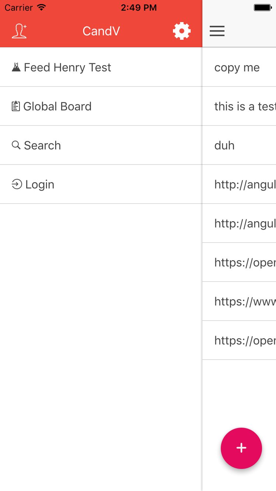
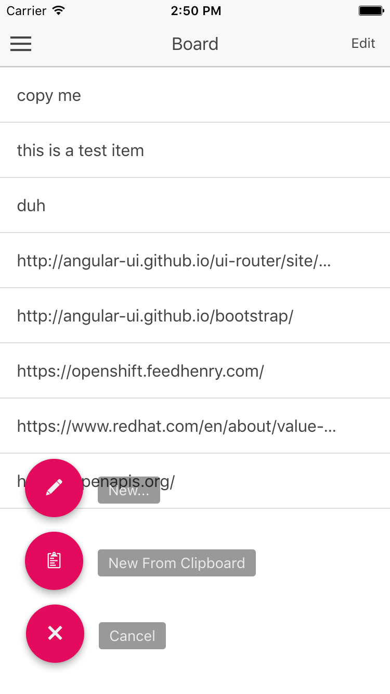

# CandV ('kand-ve) Mobile
## What is this?
A copy and paste mobile application with a cloud backend. Pronounced as 'kand-ve.

Initial concept sketches:

 
 

-------

# UNDER CONSTRUCTION - SOME TEXT BELOW MIGHT BE INCOMPLETE

## How can I build/run/deploy this app?
This app build depends on the [ionic framework][3].  You will need to install that in order to build from source.  Additionally, this app is configured to be deployed and managed via Red Hat's Mobile Application Platform - previously known as [Feed Henry][4].  The platofrm provides advanced features like user authentication, file/object storage, and offline access/synchronization.

It works in conjunction with a server side backend.  Currently, you have 2 options for running the server side:
   1. run your own server
   2. use the internet accessible demo server I host.  

To run your own, get the source for the server [here][2] along with instructions on how to easily containerize and run the server backed with OpenShift.

## Notes on the CandV architecture
TBD Conceptual Arch - mobile app, paste bin analysis service, web app (client side + server side), database
TBD Deployment Arch - Feed Henry, OpenShift

### Notes on scaling
TBD - supporting thousands of users

## License
Under the terms of the [MIT][1].

[1]: https://opensource.org/licenses/MIT
[2]: https://github.com/dudash/candv/
[3]: https://ionicframework.com
[4]: http://www.feedhenry.com/